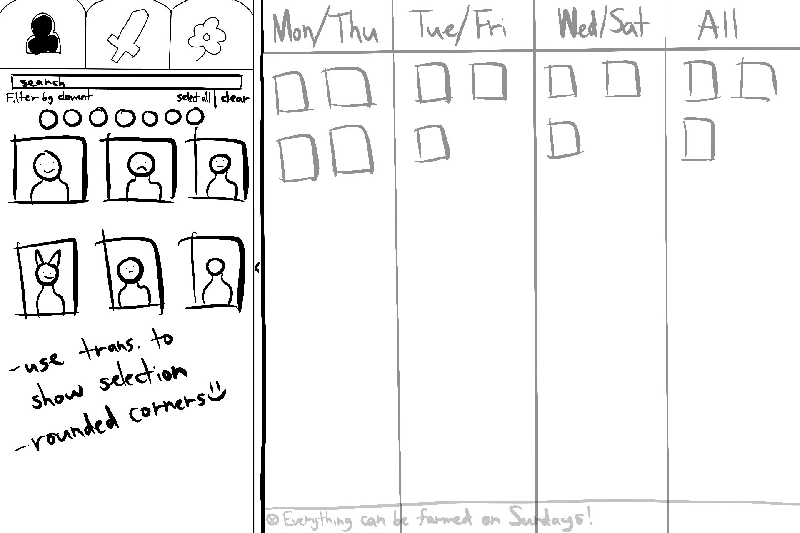

#### Turning in Your Outline / Project
1. A brief description of what you created, and a link to the project itself (two paragraphs of text)
// TODO: Matthew !!!
*REMEMBER: Excellent projects typically serve someone/some group; for this assignment you need to define your users and stakeholders. I encourage you to identify projects that will have impact, either artistically, politically, or in terms of productivity.*

2. Any additional instructions that might be needed to fully use your project (login information etc.)

- In order to save your preferences across instances of the program, you must be logged in.  A user can log in using github and this will cause the application to back up the user's preferences into the database.

3. An outline of the technologies you used and how you used them.
// TODO: Nick !!!

4. What challenges you faced in completing the project.
- **Database**: Having the application sync data between a user's session and the database was challenged due to the nature of how react loads components.  We kept running into an issue where the component would updateDB before the users preferences could get loaded from the db, causing the database to be wiped.  We remidied this by using a loading state that would utilized through the application to load data.

- **Data Syncronization**: Pressing the toggleable buttons on our project was not updating the calendar without refreshing the webpage.  We overcame this issue by using temporary arrays and react state setter function and using useEffect to look for updates in these arrays.

- **TypeScript/TSX**: This was the first time most of the team utilized react and typescript.  This was a big learnign curve that slowed down our progress in the early stages of development.  Through more expose to the technologies we were able to create an application in typescript and react, however learning the use of types, states, and props presented a challenge for our team.

- **API**: Finding an API that contained the information we were looking for along with being up to date proved challenging.  We overcame this by finding json files with up to date data.  We still had to debug issues with the json found [online](https://github.com/bongikairu/genshin-farming-database) as it referenced files we did not have access to.

- **Formatting**: Our UI Team was tasked with fitting a lot of information into a screen and making that information easy to understand. To improve our UI/UX, the UI team created mockups that the rest of the team looked into and voted on a design that best portrayed the information.

5. What each group member was responsible for designing / developing.
- Andrew: Database(some frontend, database, formatting, server handling of data & logged in users), Calendar, setting materials based on user preferences, Github Authentication & Users (frontend/middleware), automatically update database on updated prefs, assisted on API import and debugging.

- Nick

- Errica

- Michael

- Matthew

6. A link to your project video.
// TODO: Team !!!
